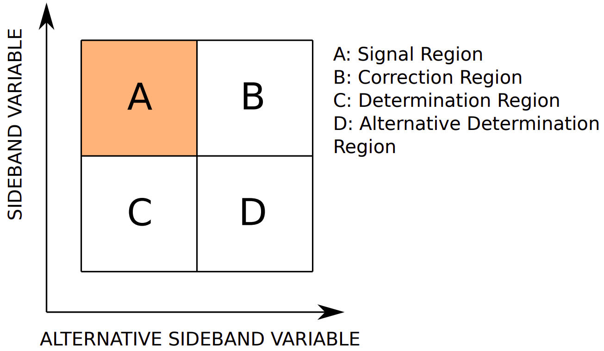

# BDTFakeFactors

This directory is to produce fake factors for hadronic taus using the BDT reweighting method described here https://arogozhnikov.github.io/hep_ml/reweight.html.
It is currently set up to work with CMSSW_10_2_19.

## Method

The method is a machine learning fake factor method, to reweight a highly dimensional dataset with events that fail a tau ID on to events that pass the tau ID.
It reweights regions B, C and D (as shown in the diagram below) simultaneously.
It will also fit this fake rate on every hadronic tau selected in the event simultaneously.
The resulting reweights applied to the fail ID in A will model the background of jet fakes in the pass ID region.

<p align="center">
  
</p>

## Inputs

All inputs are given by a yaml file placed in the config folder. 
This is used to tell the algorithm what specific root files, selections and variables need to be used.
The channel needs to be set to match the objects selected.
The algorithm will fit fake factors for whenever "t" appears in the channel name.
This config needs to be parsed whenever running a step to derive fake factors.
Examples of yaml are shown in the config folder.

## Making dataframes

Pandas dataframes are made from the parsed config file by the following command.

```bash
python scripts/make_dataframes.py --cfg="configs/mmtt.yaml"
```

There are also options to submit to the batch and turn up printed output for easier debugging.
If submitting this option to the batch, 4 cores may need to be requested in order to not run out of memory.
This will then create pickle files of the dataframes in each region B, C and D and store them in the dataframes folder.
Separate dataframes are stored for data, MC jet fakes and MC others, as well as B, C and D in the pass and fail tau ID regions.

## Purify fitting region

As it is not always possible to define a pure region of jet fakes in data, the contamination from other processes needs to be removed.
To do this we train a BDT to separate jet fakes and other MC events.
A histogram is drawn of the BDT scores on the other MC events.
The regions covered by each bin are selected in data and events are randomly removed until the removed events equal the bin content in other MC events.
This has been shown to yield compatible results for each fitted variable to 1D histogram subtraction.

The below command can be used to run this step.

```bash
python scripts/do_subtraction.py --cfg="configs/mmtt.yaml"
```

This similarly has batch and verbosity options. There are also options to load the subtraction models from the BDTs folder, where after running the BDT will be stored in a pickle file.
This will create datasets named with subtracted.

You can also use the shift option which takes in up or down to shift the amount of MC subtracted up or down by 10\%.

## Running reweights - simple

To run the reweights simply you can run the following command.

```bash
python scripts/do_reweighting.py --cfg="configs/mmtt.yaml"
```

Again this has batch and verbosity options. 
You can also split the plotting by years and test/train.
If you have a hyperparameters or a model already trained you want to use, you can also load these in.
The code produce reweight and closure plots and put these in the plots folder as well as saving the BDTs and hyperparameters used in the relevant folder.

If you want to add the non closure uncertainties (next step) to the plot you can run the following command.
```bash
python scripts/do_reweighting.py --cfg="configs/mmtt.yaml" --load_models --add_uncerts="BDTs/ff_non_closure_uncertainties_mmtt.json"
```

## Running reweights - hyperparameter scans

To find the best model, you will need to a run hyperparameter scan. You can do this with the following commands.

```bash
python scripts/do_reweighting.py --cfg="configs/mmtt.yaml" --scan_batch --no_plots
python scripts/do_reweighting.py --cfg="configs/mmtt.yaml" --collect_scan_batch
```
This final option can be submitted to the batch.

## Non closure uncertainties

To estimate the uncertainty of non closure in the fitting region the following code can be used.
```bash
python scripts/do_non_closure_uncertainty.py --cfg="configs/mmtt.yaml"
```
This draws each variable in the fitting region into a histogram and finds the difference in each variable between the reweights times fail tau ID and pass tau ID regions.
This then writes lambda functions for each variable into a json file to be used when adding reweights to trees.

## Adding to trees

An example of adding these reweights to trees is shown below. 
There are parts of this code that are currently hard coded to the four tau analysis, so check outputs carefully.
```bash
python scripts/add_ff_to_trees.py --input_location=/vols/cms/gu18/Offline/output/4tau/2018_1907 --output_location="./" --filename=TauB_mmtt_2018.root --channel=mmtt --year=2018 --splitting=100000 --offset=0
```

However, as you need to run a lot of jobs for an analysis, these can be submitted to the batch with this script.
```bash
python scripts/batch_add_to_trees.py --input_location=/vols/cms/gu18/Offline/output/MSSM/vlq_2018_bkg_data/ --output_location=/vols/cms/gu18/Offline/output/MSSM/vlq_2018_bdt
```
